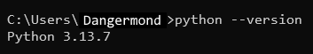

# ArcGIS Pro 3.6 PDX Python Production Environment

## Purpose

The "production environment" (aka prod-env) is a customized version of the base ArcGIS Pro python environment. It contains additional packages that are used in the PDX production tools. ArcGIS Pro uses [conda](https://docs.conda.io/en/latest/) to manage its python environment and packages.

## Prerequisites

1. ArcGIS Pro 3.6 is installed on your computer.
2. You can access the `I:` drive.
3. An environment with the same name as the to-be-installed prod-env does not already exist on your PC (usually unlikely, but this installer does not reinstall at this time).

## Installation

1. Goto `I:\test\ARC_PRO_CONDA\arc36_environment\`. Right click on `prod_env_installer.ps1` and select "Run with powershell". The exact menu item may look different depending on Windows 10 or 11.
    
    
    

    A console window will appear and you may see 2 security related confirmation prompts.
    - For _Execution Policy Change_, enter **N** or press Enter.
    - For _Security warning_, enter **R**.

    

    Then the installation script will run and you will see a console like this:
    

2. The installer will **automatically activate** the production environment as the default active environment within ArcGIS Pro. You can confirm by going to _Settings > Package Manager_ within ArcGIS. If the production environment is not active, you can activate it by selecting it from the drop-down on the right.

## Post-installation

The following should be true after installation:
1. The production environment is created.
2. The production environment is the default activated environment in ArcGIS Pro.
3. The `python` command in the command prompt should be the one provided by the production environment.
    
