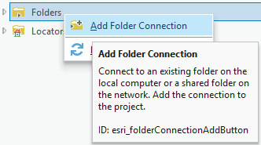
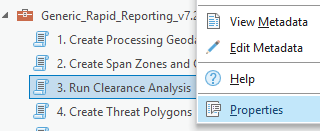
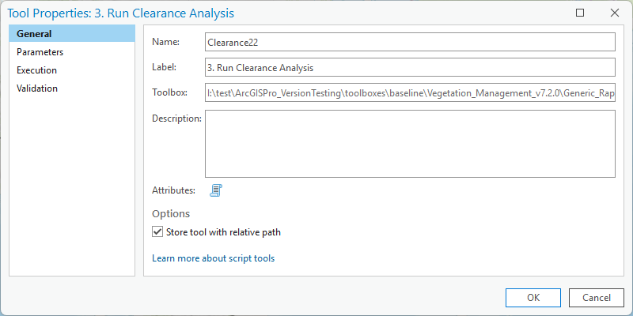
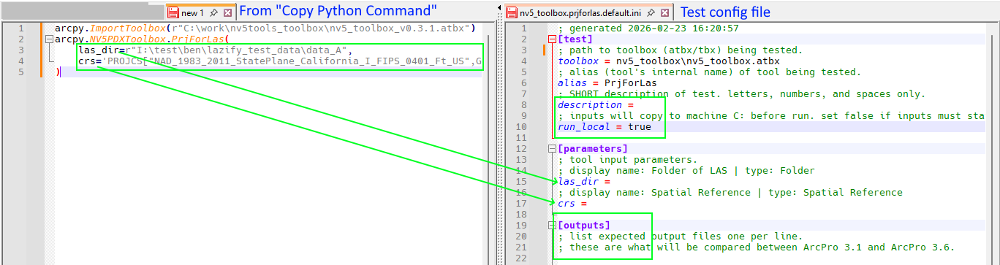

# How to setup tool tests for ArcPro v3.1 ⇨ v3.6

## Overview

This portion of testing toolboxes for compatibility with ArcGIS Pro v3.6 is largely automated. The core idea is that the tool will be run in v3.1 and v3.6 with the same input data and parameters. The tool will be evaluated based on (1) did it run without a crash? (2) is the output data the same? If both are true, the tool passes. When a tool fails, the JTree team will investigate the cause, modify the tool, and retest. This process will repeat iteratively until all tools pass.

This automation requires that each tool has some configuration describing the input data, tool parameters, and expected outputs to be compared.

After preparing this configuration, you will not have to run

toolboxes: I:\test\ArcGISPro_VersionTesting\toolboxes\baseline
tests: I:\test\ArcGISPro_VersionTesting\tests

### Anatomy of a test

Each tool test is a folder containing input data and a configuration file.

The **test folder** will be named according to the scheme `toolbox_name.tool_alias.variant`. For example `x.y.default`. The _variant_ portion will be `default` for all initial test folders. The purpose of _variant_ is when we want to test the same tool multiple times _with different input data_.

Within the folder is a **configuration file** (refered to as "config .ini"). This file will be named the same as the test folder, for example `x.y.default.ini`. We can create multiple configuration files in the same test folder if we want to run the same tool multiple times _on the same input data_ with different non-data parameters. This is a _subtest_.

See [Advanced configurations](#advanced-configurations) for more information about setting up test variants and subtests.

The other item in a test folder is an **empty folder named `inputs`**. This will contain [all the data required](#choosing-good-data) for the tool to run. It is also where the tool should save any new output files. When the tool is run in the automated test program, its whole world should be in the `inputs` folder.

toolbox.tool.variant
inputs/
config .ini: toolbox.tool.variant.subtest

inputs:
think of this as a snapshot of all the things you need to run this particular tool
outputs:
what does the tool do that i really care about?

## Choosing good data

smallish but representative.
might be a subset of a "normal" dataset, for example 6 las files from 100. you might have to remake tile indexes or other ancillary inputs to match the subset.

## Essential workflow

### Prepare ArcGIS

1. Open ArcGIS Pro v3.1. You may want to create a new project to start fresh.

1. Add the toolboxes from `I:\test\ArcGISPro_VersionTesting\toolboxes\baseline` to your project's Catalog. 

    You can drag-and-drop from the toolboxes folder or use Add Folder Connection in Catalog. This is the same as you'd do normally when using production toolboxes in ArcGIS, but they're already unzipped into their home.

    

<!--
1. You'll need to see the tool's "alias", which is the tool's internal name that ArcGIS uses. The alias is used to refer to the tool in most subsequent steps.
    1. Right click on the tool and choose Properties.
    2. The alias is shown in the "Name" field of the Properties dialog.

    
    
-->

### Gather input data

1. You will find each tool's test in a folder within `I:\test\ArcGISPro_VersionTesting\tests`. It will be named `toolbox.alias.default`. Within that folder will be 2 items: a folder named `inputs` and a config .ini file with a name that matches the test folder.

1. Any input data (GDBs, shapefiles, las, tifs, txt, csv, xml, dxf, npy, ...) should be copied to `inputs`. You can organize files within `inputs` as you like.

### Setup tool test configuration

1. When the data is setup in `inputs`, open the tool in ArcPro and adjust the tool's parameters as if you were going to run it on the data in `inputs`.

1. Any newly created outputs files should _also_ be saved to the `inputs` folder.

1. Click the ⌄ menu on the Run button and choose _Copy Python Command_ from the menu. This will place a small amount of python code in your clipboard.
    
    

1. Paste this into a blank Notepad/Notepad++ or somewhere else temporarily.

1. Open the config .ini file for the test. Notepad++ has colored text for .ini, but any text editor will work.

    You'll notice that the text from _Copy Python Command_ has a list of parameters for the tool that match the list in the `[parameters]` section of the config .ini.

    

1. Copy the parameter values from the python code into the analogous item in the config .ini.

    1. Any of the files from `inputs` should be shortened to start with `inputs\`. For example, `I:...\toolbox.alias.default\inputs\my_data.gdb` would become `inputs\my_data.gdb`.
    1. The config .ini will start filled with the tool's default values, if present.
    1. Parameters with values `None`, `""`, or `"#"` can be ignored and left blank in the config .ini.
    1. You can remove the quotes (" or ') around the parameter values in the .ini file.

    

#### [test] section

1. If the tool input data **must** exist on the I: (notably, for condor tools), then change `run_local` from its default of `false` to `true`.

1. You can optionally add a short `description` about this specific tool test setup is about.

```
arcpy.ImportToolbox(r"I:\test\ArcGISPro_VersionTesting\toolboxes\baseline\nv5_toolbox\nv5_toolbox.atbx")
arcpy.NV5PDXToolbox.AOILandCover(
    input_fc=r"C:\test_data\land_cover_tool\duke_giant\merged_spans.shp",
    output_fc=r"C:\test_data\land_cover_tool\duke_giant\merged_spans_landcover.shp",
    landcover_raster="CONUS",
    output_classes="3 class - urban, mixed, rural",
    buffer_distance=152,
    dissolve_all=False,
    group_field=None
)

arcpy.ImportToolbox(r"I:\test\ArcGISPro_VersionTesting\toolboxes\baseline\nv5_toolbox\nv5_toolbox.atbx")
arcpy.NV5PDXToolbox.CorridorMileageEstimator(
    Workspace__Select_the_folder_where_your_want_the_outputs_to_go__=r"C:\test_data\land_cover_tool\duke_giant",
    Alignment_or_Centerline__shp=r"C:\test_data\land_cover_tool\duke_giant\merged_spans.shp",
    Buffer_Distance__in_units_of_output_coordinate_system_="10",
    Naming_Prefix__for_buffer_and_centerline_="x",
    Dissolve_Field=""
)
```

#### [outpus] section

1. Any

## Advanced configurations

stuff about variants:
subtest ini .default -> .default.cfg1, .default.cfg2
folders .default -> .something

## Glossary

baseline: anything related to the prior version of ArcGIS
target: anything related to the new version of ArcGIS
toolbox: a collection of geoprocessing tools, usually contained in a folder with an atbx or tbx file, scripts, and other additional files.
tool: TODO a single item within a toolbox, usually corresponding to a script
test: a folder containing `inputs` and `toolbox.tool.default.ini` for an individual tool.
configuration file:
input:
outputs:
alias: a tool's internal name