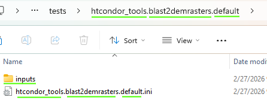
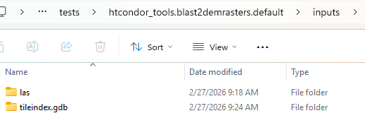
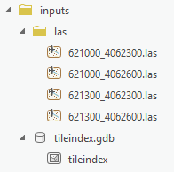
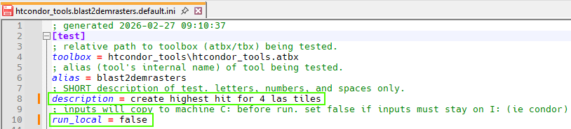
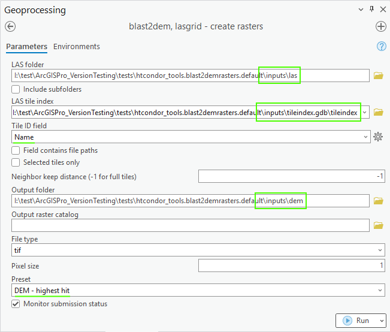
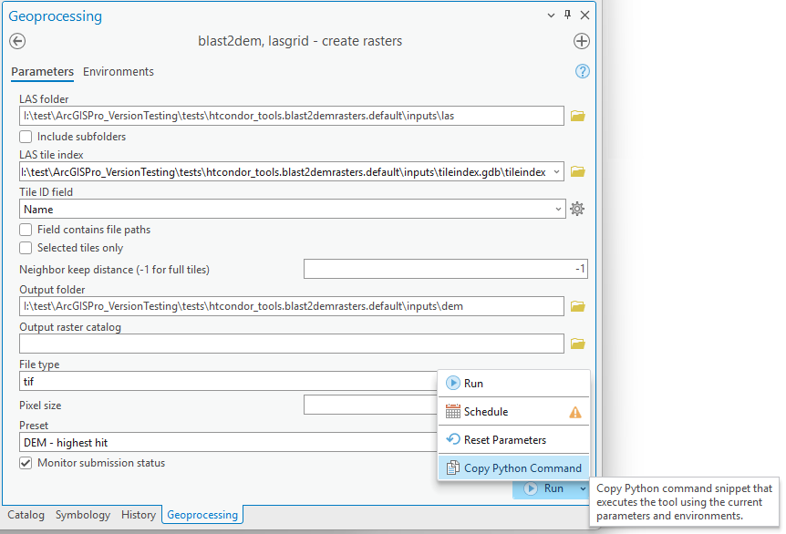
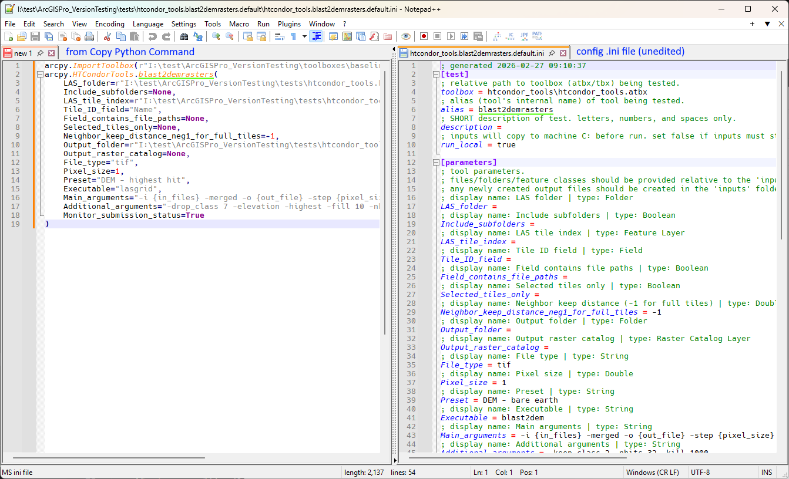
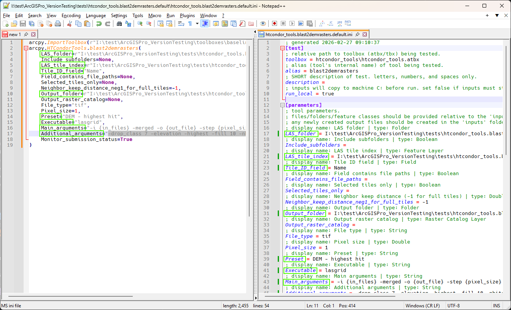
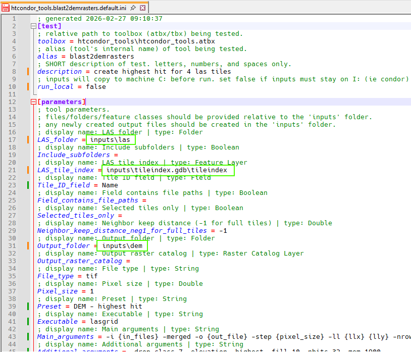
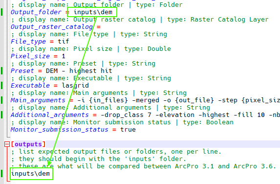

# How to setup tool tests for ArcPro v3.1 ⇨ v3.6

## Overview

This portion of testing toolboxes for compatibility with ArcGIS Pro v3.6 is largely automated. The core idea is that the tool will be run in v3.1 and v3.6 with the same input data and parameters. The tool will be evaluated based on (1) did it run without a crash? (2) is the output data the same? If both are true, the tool passes. When a tool fails, the JTree team will investigate the cause, modify the tool, and retest. This process will repeat iteratively until all tools pass.

This automation requires that each tool has some configuration describing the input data, tool parameters, and expected outputs to be compared.

!!! success ""
    Your task, as the expert in the tool's usual operation and data, is to prepare this input and configuration. You will not be required to run the tools over and over as JTree addresses issues.

#### Important folders

| Name | Path |
| ---  | --- |
| toolboxes | I:\test\ArcGISPro_VersionTesting\toolboxes\baseline |
| tool test folders | I:\test\ArcGISPro_VersionTesting\tests |

### Anatomy of a test

Each tool test is a folder containing a _configuration file_ and _input data_.

The **test folder** will be named according to the scheme `toolbox_name.tool_alias.variant`. For example `x.y.default`. The _variant_ portion will be `default` for all initial test folders. The purpose of _variant_ is when you want to test the same tool multiple times _with different input data_.

Within the folder is a **configuration file** (refered to as "config .ini"). This file will be named the same as the test folder, for example `x.y.default.ini`. You can create multiple configuration files in the same test folder if you want to run the same tool multiple times _on the same input data_ with different non-data parameters. This is a _subtest_.

See [Advanced configurations](#advanced-configurations) for more information about setting up test variants and subtests.

The other item in a test folder is an **empty folder named `inputs`**. This will contain [all the data required](#choosing-good-data) for the tool to run. It is also where the tool should save any new output files. When the tool is run in the automated test program, its whole world should be contained within the `inputs` folder.

## Choosing good data

Good testing data is smallish but representative. The goal is to "exercise" the tool in the way it's most commonly used.

This might be a subset of a "normal" dataset you'd use in production. For example 4 las files from 100. Or perhaps a smaller circuit with a mix of different threat detections. When choosing a subset, it's a good idea to choose adjacent or contiguous pieces.

You might have to remake tile indexes, clipping shapes, or other ancillary inputs to match the subset. That will depend on the tool, as some tools can tolerate "missing" data and others cannot. It's ok if a tool produces a yellow warning when it runs, but the data chosen should allow the tool to run to completion without red error messages (or crashes!).

That data should be copied to the `inputs` folder, and then _not modified_.

## Essential workflow

### Prepare ArcGIS

1. Open ArcGIS Pro v3.1. You may want to create a new project to start fresh.

1. Add the toolboxes from `I:\test\ArcGISPro_VersionTesting\toolboxes\baseline` to your project's Catalog. 

    You can drag-and-drop from the toolboxes folder or use Add Folder Connection in Catalog. This is the same as you'd do normally when using production toolboxes in ArcGIS, but they're already unzipped into their home. You don't need to copy them to your workstation.

    

<!--
1. You'll need to see the tool's "alias", which is the tool's internal name that ArcGIS uses. The alias is used to refer to the tool in most subsequent steps.
    1. Right click on the tool and choose Properties.
    2. The alias is shown in the "Name" field of the Properties dialog.

    
    
-->

### Gather input data

1. You will find each [tool's test in a folder](#anatomy-of-a-test) within `I:\test\ArcGISPro_VersionTesting\tests`. It will be named `toolbox.alias.default`. Within that folder will be 2 items: a folder named `inputs` and a config .ini file with a name that matches the test folder.

    

    !!! tip
        [Tools/Tests index](tool_test_names.md) contains a table of toolboxes, tool display names, and the test folder name.

1. Any input data (GDBs, shapefiles, las, tifs, txt, csv, xml, dxf, npy, ...) should be copied to `inputs`. You can organize files within `inputs` as you like.

    !!! success ""
        Think of `inputs` as a snapshot of all the things you need to run this particular tool _just_ before you press the Run button.

    
    

### Setup tool test configuration

1. Open the config .ini file for the test. Notepad++ has colored text for .ini, but any text editor will work.

#### [test] section

1. If the tool input data **must** exist on the I: (notably, for condor tools), then change `run_local` from its default of `false` to `true`.

1. You can optionally add a short `description` about this specific tool test setup.

    

#### [parameters] section

1. When the data is setup in `inputs`, open the tool in ArcPro and adjust the tool's parameters as if you were going to run it on the data in `inputs`.

    !!! info
        If you _do_ want to run the tool once to make sure the parameters are correct, please make a **temporary copy** of `inputs` and use that to avoid accidently modifying anything in `inputs`.

    

1. Any newly created outputs files should _also_ be saved to the `inputs` folder.

    

1. Click the ⌄ menu on the Run button and choose _Copy Python Command_ from the menu. This will place a small amount of python code in your clipboard.
    
    

1. Paste this into a blank Notepad/Notepad++ or somewhere else temporarily.

    You'll notice that the text from _Copy Python Command_ has a list of parameters for the tool that match the list in the `[parameters]` section of the config .ini.

    

    !!! tip
        The comments in config .ini above each parameter show the parameter's display name in ArcGIS and its type.

1. Copy the parameter values from the python code into the matching item in the config .ini.

    1. Don't include any `r` prefix on the parameter values from the python code.
    1. You may include the quotes ( " or ' ) around the parameter values from the python code, though it's ideal to remove them and copy only the value.
    1. The config .ini will start filled with the tool's default values, if present. Don't forget to change these if you modified the default parameters when setting up the tool in ArcGIS.
    1. Any of the files from `inputs` should be shortened to start with `inputs\`. For example, `I:\test\ArcGISPro_VersionTesting\tests\htcondor_tools.blast2demrasters.default\inputs\tileindex.gdb\tileindex` would become `inputs\tileindex.gdb\tileindex`.
    1. Parameters with values `None`, `""`, or `"#"` can be ignored and left blank in the config .ini.

    
    

#### [outputs] section

1. Any newly created output files or modified inputs that are important must be listed one per line . Format the lines as you did for parameters.

    !!! success ""
        What does the tool do that I really care about?

    1. If the item is something in a Geodatabase (eg feature class), list only the geodatabase.
    1. You may list folders (see example in image).
    1. If a tool produces some extra files that really aren't important, you can omit those.
    1. If the tool doesn't produce anything or modify anything, this section can be left empty.

    

!!! success
    That's it!   Don't forget to save your changes to the config .ini. 😊

## Advanced configurations

stuff about variants:
subtest ini .default -> .default.cfg1, .default.cfg2
folders .default -> .something

## Glossary

| term | detail |
| ---  | --- |
| baseline | anything related to the _current_ version of ArcGIS. |
| target | anything related to the _new_ version of ArcGIS. |
| toolbox | a collection of geoprocessing tools, usually contained in a folder with an atbx or tbx file, scripts, and other additional files. |
| tool | a single item within a toolbox, usually corresponding to a script. |
| test | a folder containing an `inputs` folder and config .ini file (`toolbox.alias.default.ini`) for an individual tool. | |
| configuration file | aka config .ini, is a text file specifying vital information for a tool test such as parameter values and expected outputs. |
| inputs | |
| outputs | |
| alias | a tool's internal name |

## Questions?

If you have questions, please message **Ben Stabley** on the JTree team.

Thank you